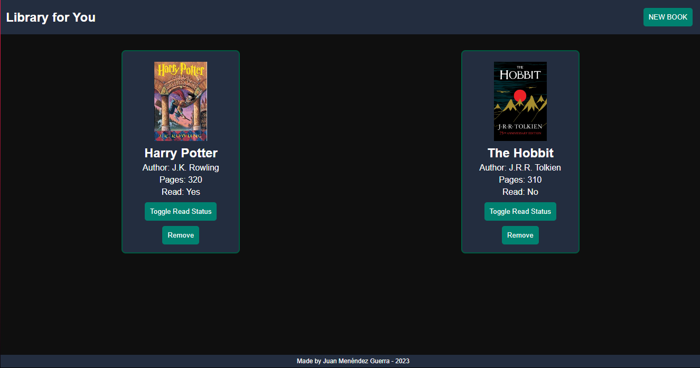

# 📚 Library for You
Dive into a world where managing your favorite books is just a click away! "Library for You" is a web-based application designed to help bibliophiles and casual readers alike keep track of their reading collections. Whether you've just started a book or have finished reading it, this digital library is crafted to cater to your reading journey, providing a seamless user experience.

Key Features:
📖 Manage Your Books: Add, remove, and toggle the reading status of books in your collection.
🎨 Visually Appealing: A dark-themed, user-friendly interface that is easy on the eyes and straightforward to navigate.
🔄 Dynamic Updates: Instantly see changes in your library without needing to refresh the page.
🖼️ Book Previews: Visualize your reading list with book cover images.
🚀 No Backend Required: Runs client-side, no server setup needed!

# Check it out: https://menendezguerra.github.io/library/